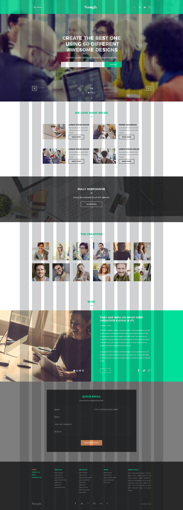

# Saugh Landing Page

Landing Page moderna, rápida y optimizada para promocionar a creativos. El proyecto está estructurado para facilitar el mantenimiento, la escalabilidad y el despliegue, utilizando herramientas modernas como Sass, PostCSS, RollupJS y WebP.

---

## 📸 Vista previa

<!-- Reemplaza con una imagen real si tienes una -->


---

## 📂 Estructura del proyecto

```bash
drone-landing-page/
├── dist/                  # Archivos finales para producción
│   ├── assets/
│   │   ├── icons/
│   │   └── images/
│   ├── css/
│   ├── js/
│   └── index.html
├── src/                   # Archivos fuente
│   ├── assets/
│   │   ├── icons/
│   │   └── images/
│   ├── css/
│   ├── js/
│   ├── sass/
│   └── index.html
├── htmlminifier.config.js       # Configuración de minificación HTML
├── imagesminifier.config.js     # Conversión de imágenes a WebP
├── copyIcons.config.js          # Script para copiar íconos a producción
├── postcss.config.js            # Configuración de PostCSS
├── rollup.config.js             # Configuración de RollupJS
├── package.json
└── README.md
```

## 🛠️ Tecnologías utilizadas
- **HTML5** limpio y semántico
- **Sass** (`.scss`) para estilos escalables
- **PostCSS**, con los siguientes plugins:
  - `postcss-import`
  - `postcss-nesting`
  - `autoprefixer`
  - `cssnano`
  - `@fullhuman/postcss-purgecss`
- **Bootstrap 5.3.5** compilado desde Sass
- **RollupJS** para empaquetado y minificación de JavaScript
- **HTML Minifier** (`html-minifier`) para comprimir el HTML
- **WebP** con `imagemin` para optimización de imágenes
- **Chokidar CLI** para observar archivos HTML
- **Concurrently** para ejecutar procesos simultáneos


## 🚀 Scripts disponibles
En el archivo package.json:

| Script                    | Descripción                                           |
| ------------------------- | ----------------------------------------------------- |
| `npm run build`           | Compila todos los archivos para producción.           |
| `npm run dev`             | Ejecuta el entorno de desarrollo con watchers.        |
| `npm run build:html`      | Minifica el HTML (`index.html`) y lo copia a `dist/`. |
| `npm run build:images`    | Convierte imágenes a WebP y las copia a `dist/`.      |
| `npm run build:icons`     | Copia los íconos SVG a `dist/`.                       |
| `npm run build:bootstrap` | Compila Bootstrap desde SCSS a CSS minificado.        |
| `npm run build:sass`      | Compila Sass personalizado (`main.scss`).             |
| `npm run build:css`       | Procesa CSS con PostCSS y lo guarda en `dist/`.       |
| `npm run build:js`        | Empaqueta y minifica el JavaScript con RollupJS.      |
| `npm run dev:html`        | Observa cambios en HTML y vuelve a compilarlo.        |
| `npm run dev:bootstrap`   | Observa y recompila Sass de Bootstrap.                |
| `npm run dev:sass`        | Observa y recompila tu Sass personalizado.            |
| `npm run dev:css`         | Observa y recompila CSS con PostCSS.                  |
| `npm run dev:js`          | Observa y recompila el JavaScript con Rollup.         |


## 🔧 Instalación
Clona el repositorio:
```bash
git clone https://github.com/boris-calli/saugh-landing-page.git
cd saugh-landing-page
```
Instala las dependencias:
```bash
npm install
```
Ejecuta el entorno de desarrollo:
```bash
npm run dev
```
Genera una build para producción:
```bash
npm run build
```


## 📦 Dependencias clave
- `@rollup/plugin-node-resolve`
- `@rollup/plugin-commonjs`
- `rollup-plugin-esbuild-minify`
- `postcss-cli`
- `autoprefixer`
- `cssnano`
- `postcss-nesting`
- `postcss-import`
- `@fullhuman/postcss-purgecss`
- `html-minifier`
- `imagemin`
- `imagemin-webp`
- `sass`
- `bootstrap`
- `concurrently`
- `chokidar-cli`
- `fs-extra`

## 🧪 Producción final
Todos los archivos generados para producción se ubican en la carpeta dist/. Contiene:

- `dist/index.html` (HTML minificado)
- `dist/css/styles.min.css` (CSS final)
- `dist/js/scripts.min.js` (JavaScript final)
- `dist/assets/images/` (imágenes optimizadas en WebP)
- `dist/assets/icons/` (íconos SVG copiados)

## 📩 Contacto
Si tienes dudas o deseas contactarme para trabajo freelance:

GitHub: @boris-calli

Email: boris.v.calli.r@gmail.com

## 📄 Licencia
Este proyecto está licenciado bajo la MIT License.